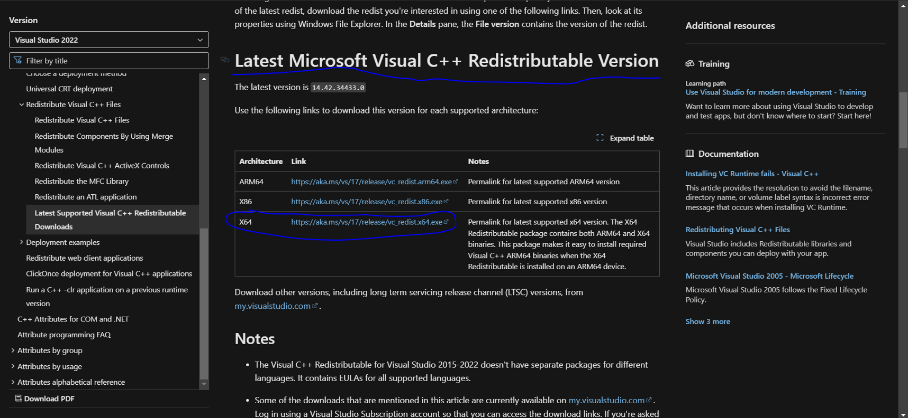

# Sadržaj
- [1. Uvod](#1-uvod)
- [2. Izgled projekta](#2-izgled-projekta)
- [3. Pokretanje mog projekta](#3-pokretanje-mog-projekta)
   - [1. Kreiranje radnog okruženja](#1-kreiranje-radnog-okruženja)
   - [2. Startovanje Docker-a](#2-startovanje-docker-a)
   - [3. Otvorite terminal ili shell](#3-otvorite-terminal-ili-shell)
   - [4. Povlačenje slike sa Docker Hub-a](#4-povlačenje-slike-sa-docker-hub-a)
   - [5. Pokretanje kontejnera](#5-pokretanje-kontejnera)
   - [6. Pristup aplikaciji](#6-pristup-aplikaciji)
- [4. Kako kreirati projekat od nule?](#4-kako-kreirati-projekat-od-nule)
   - [Kreiranje/Treniranje modela](#kreiranjetreniranje-modela)
      - [1) Otvorite Google Colab i instalirajte potrebne biblioteke: TensorFlow, Pandas, NumPy.](#1-otvorite-google-colab-i-instalirajte-potrebne-biblioteke-tensorflow-pandas-numpy)
      - [2) Priprema Podataka](#2-priprema-podataka)
      - [3) Procesiranje podataka](#3-procesiranje-podataka)
      - [4) Kreiranje modela](#4-kreiranje-modela)
      - [5) Kreiranje callback-ova](#5-kreiranje-callback-ova)
      - [6) Treniranje modela](#6-treniranje-modela)
      - [7) Evaluacija modela](#7-evaluacija-modela)
      - [8) Čuvanje modela](#8-čuvanje-modela)
      - [9) Učitavanje modela](#9-učitavanje-modela)
      - [10) Analiza modela nad podacima](#10-analiza-modela-nad-podacima)
   - [Postavljanje okruženja](#postavljanje-okruženja)


# 1. Uvod

Ova aplikacija za prepoznavanje rasa pasa koristi veštačku inteligenciju i unapred treniran model kako bi identifikovala rasu psa na osnovu učitane slike. Glavne funkcionalnosti aplikacije uključuju:

- **Prepoznavanje rasa pasa**: Korisnici mogu učitati sliku psa, a aplikacija će analizirati vizuelne karakteristike i predložiti rasu sa najvišom verovatnoćom.
- **Vizualizacija rezultata**: Pored predložene rase, aplikacija prikazuje učitanu sliku i grafički prikaz nivoa pouzdanosti predikcije.
- **Jednostavno korisničko iskustvo**: Aplikacija pruža intuitivan grafički interfejs, gde korisnici mogu učitati slike direktno iz svog sistema.

# 2. Izgled projekta

Na sledećoj slici imate prikazan izgled aplikacije: 


Na drugoj slici možete videti kako se aplikacija koristi:  


# 3. Pokretanje mog projekta

Da biste pokrenuli aplikaciju, pratite sledeće korake:

### 1. **Kreiranje radnog okruženja**  
   Kreirajte prazan folder na vašem računaru gde će aplikacija raditi. Na primer:  
   - Na Windows-u: Kliknite desnim tasterom miša na radnu površinu ili u direktorijumu → **New** → **Folder** → Unesite naziv (npr. `dog-app`).  
   - Na Linux-u ili macOS-u: Otvorite terminal i unesite sledeće komande:  
     ```bash
     mkdir dog-app
     cd dog-app
     ```

### 2. **Startovanje Docker-a**  
   Uverite se da Docker radi na vašem sistemu:  
   - Na Windows-u ili macOS-u: Pokrenite **Docker Desktop**.  
   - Na Linux-u: Proverite i startujte Docker servis pomoću sledeće komande:  
     ```bash
     systemctl start docker
     ```

### 3. **Otvorite terminal ili shell**  
   U folderu koji ste kreirali, otvorite terminal, komandnu liniju ili shell:  
   - Na Windows-u: Shift + Desni klik u folderu → **Open PowerShell window here**.  
   - Na Linux-u/macOS-u: Otvorite terminal i pređite u folder pomoću komande:  
     ```bash
     cd dog-app
     ```

### 4. **Povlačenje slike sa Docker Hub-a**  
   Pokrenite sledeću komandu da biste preuzeli Docker sliku aplikacije:  
   ```bash
   docker pull 17jo/dog_breed_classification:1.0
   ```
### 5. **Pokretanje kontejnera**  
   Kada se slika preuzme, pokrenite aplikaciju sledećom komandom:
   ```bash
   docker run -p 5000:5000 17jo/dog_breed_classification:1.0
   ```
### 6. **Pristup aplikaciji**
Kada se kontejner pokrene, otvorite web pregledač i idite na sledeću adresu:**
   ```bash
    http://localhost:5000
   ```

# 4. Kako kreirati projekat od nule?
##  Kreiranje/Treniranje modela
   Pre nego što uopšte krenemo sa postavljanjem okruženja. Potrebno je u google colab-u istrenirati model koji ćemo kasnije da skinemo i importujemo u naš projekat. 
   Ukoliko krenete prvo da postavljate okruženje, nećete biti u mogućnosti da ispunite korak f), zato što nemate model.
   
   ### 1) Otvorite Google Colab i instalirajte potrebne biblioteke: TensorFlow, Pandas, NumPy.

   ```bash
      from IPython.display import Image
      from sklearn.model_selection import train_test_split

      import tensorflow as tf
      import pandas as pd
      import numpy as np
      import os
   ```
   ### 2) Priprema Podataka
   
   Podaci su preuzeti sa Kaggle sajta: https://www.kaggle.com/competitions/dog-breed-identification. Prvo želimo da skinemo podatke, zatim ih postavimo na Google Drive, a ako su u zip formatu, raspakujemo ih u Colabu.
      
   ```bash
      !unzip "/content/drive/MyDrive/Colab_Notebooks/dataset.zip" -d "/content/drive/MyDrive/Colab_Notebooks"
      ```
      Putanje do neophodnih foldera u kojima se nalaze podaci koji ce nam biti potrebni za treniranje i evaluaciju modela.
      ```bash
      LABELS_PATH = "/content/drive/MyDrive/Colab_Notebooks/labels.csv"
      TRAIN_IMAGES_PATH = "/content/drive/MyDrive/Colab_Notebooks/train"
      TEST_IMAGES_PATH = "/content/drive/MyDrive/Colab_Notebooks/test"
   ```
   Citanje CSV fajla gde se nalaze imena slika koje koristimo za trening algoritma i rasa psa sa slike
   ```bash
      labels_csv = pd.read_csv(LABELS_PATH)
      labels_csv.head()
   ```

      | id                                 | breed            |
      |------------------------------------|------------------|
      | 000bec180eb18c7604dcecc8fe0dba07   | boston_bull      |
      | 001513dfcb2ffafc82cccf4d8bbaba97   | dingo            |
      | 001cdf01b096e06d78e9e5112d419397   | pekinese         |
      | 00214f311d5d2247d5dfe4fe24b2303d   | bluetick         |
      | 0021f9ceb3235effd7fcde7f7538ed62   | golden_retriever |

   Imate li još neki zadatak koji treba da obavimo zajedno?
         Da vidimo koliko imamo ukupno podataka i distinkthih/unikatnih rasa pasa

   ```bash
         unique_breeds = labels_csv['breed'].unique()
         print(f"Ukupno = {len(labels_csv)}\nUnikatnih rasa = {len(unique_breeds)}")
   ```

   

   Da vidimo koliko slika imamo za bilo koju rasu

   ```bash
      print(labels_csv["breed"].value_counts())
   ```

   

   Pripremanje nasih etiketa(labels). Transformacija u numpy array zato sto je brze raditi sa numpy nizom nego sa python listama.

   ```bash
      labels_breeds = labels_csv['breed']
      labels_np = np.array(labels_breeds) 
      labels_np, len(labels_np)
   ```

   

   Pošto je mnogo lakse i optimanlnije raditi sa samo imenima slika(string) i njihovim putanjama(string) prvo ćemo napraviti listu sa svim putanjama do slika(imena slika + putanju do njih).

   ```bash
      filenames = [TRAIN_IMAGES_PATH + "/" + fname + ".jpg" for fname in labels_csv["id"]]
         filenames[:10]
   ```

   

   Sada pretvaramo sve etiketa u bool vrednost

   ```bash
      bool_labels = [label == unique_breeds for label in labels]
         bool_labels[:2], len(bool_labels)
   ```

   

   ### 3) Procesiranje podataka

   Pošto nas dataset sa Kaggle-a dolazi samo sa slikama za treniranje i testiranje modela mi ćemo napraviti dataset za validaciju. To je set podataka u kome imamo etikete tj. labels za slike, znamo tačnu vrednost kojoj rasi pripada pas. Validacioni set podataka je set podataka koji koristimo da vidimo koliko je model dobro treniran, to su slike koje model nije video tokom treninga. 

   validacija - imam sliku i znam 100% koje je rase taj pas zbog csv-a. 

   test - slike koja ja ubacim sa interneta znači ne znam im rasu dajem ih modelu da ih predvidi 

   trening - podaci koje dajem modelu da bi učio

   ```bash
      X = filenames #slike tj. putanje
      y = bool_labels #rase
      X[:2], y[:2]
   ```
   Neću da postavljam kako izgleda rezultat ovoga jer je bukvalno kao i gore true,false,false... matrica.

   Sledeće linije koda dele naš dataset u dve grupe. Jedna je za trening a druga je za validaciju. koristimo train_test_split jer ta funkcija i deli i meša podatke. Mešanje je potrebno da ne bi model uhvatio sablon, desilo se da je prvih 100 slika jedna rasa pasa i on nauči jednu rasu.

   ```bash
      from sklearn.model_selection import train_test_split
      X_train, X_val, y_train, y_val = train_test_split(X,
                                                        y, 
                                                        test_size=0.2, #20% validation size
                                                        random_state=42 # same like np.random.seed(42)
                                                       )

      len(X_train), len(y_train), len(X_val), len(y_val)
   ```

   Mi ukupno imamo 10000+ slika. Kao rezultat nakon pokretanja ovog koda dobićemo 8177 slika za trening i 2045 slika za validaciju.
   

   Kreiraćemo funkciju koja će da preprocesuje sliku

   1. Uzeti putanju do slike kao input
   2. Koristeci TensorFlow za čitanje fajla/slike i sačuvati ga u variabli `image`
   3. Pretvoriti našu sliku (jpeg) u Tensor (tensor vektor sa vise dimenzija, nije matrica nego 3D)
   4. Normalizacija naše slike (pretvoriti svaki pixel iz 0-255 u 0-1) - to radimo zato sto model mnogo bolje radi sa manjim brojevima (svaki piksel se deli sa 255)
   5. Promeniti veličinu slike u veličinu (224, 224) - da bi svaka slika bila iste veličine radi lakšeg treniranja
   6. Vratiti preprocesiranu sliku `image`

   

   Pretvaranje naših podataka u Batches
      
   Zasto?

   Recimo da želimo da obradimo 10,000+ slika odjednom... moguće da neće sve stati u memoriji

   Zato ćemo uzeti 32 (veličina batch-a) slike od jednom (batch veličina se može prilagoditi po potrebi).

   Da bi koristili TensorFlow efikano, moramo naše podatke da pretvorimo u Tensor tuplove koji izgledaju `(image, label)`

   Napravićemo funkciju koja će da nam obradi sliku i vrati njenu etiketu(rasu kojoj pripada pas sa slike). Funkcija dobija putanju do slike i odgovarajuću etiketu, preprocesuje sliku i vraca tuple oblike (slika, etiketa)

   ```bash
      def get_image_label(image_path, label):
         image = preprocessing_image(image_path)
         return (image, label)
   ```

   Pošto sada imamo funkciju koja pretvara naše podatke u Tensor tuple u formatu (slika, etiketa), napravićemo funkciju koja će sve naše podatke (X i y) pretvoriti u batches!

   
      
   Kreiranje trening i validacione barche-ve

   ```bash
      train_data = create_data_batches(X_train, y_train)
      val_data = create_data_batches(X_val, y_val, valid_data=True)
   ```

   Sada nam podaci izgledaju ovako:

   

   ### 4). Kreiranje modela
   Koristila sam već postojeći model kao osnovu i samo ga specijalizovala za moj problem, MobileNetV2.

   ```bash
      def create_hub_model():
       # Ucitavanje pre-treniranog ResNet101 model bez top/poslednjeg layer-a (classification head) koji sluzi za predvidjanje
       base_model = tf.keras.applications.MobileNetV2(
           input_shape=(IMG_SIZE, IMG_SIZE, 3),
           include_top=False,
           weights='imagenet'
       )

       # "Zamrznucemo" vec treniranje lejere pre-treniranog modela
       base_model.trainable = False

       # Kreiracemo model
       hub_model = tf.keras.Sequential([
           base_model,  # Pretreniran model
           tf.keras.layers.GlobalAveragePooling2D(),  # Pooling lejer
           tf.keras.layers.Dense(1024, activation='relu'),  # Dense lejer za ucenje osobina
           tf.keras.layers.Dropout(0.2),  # Dropout/Izbaci 20% neurona da bi izbagli overfitting
           tf.keras.layers.Dense(OUTPUT_SHAPE, activation='softmax')  # Izlazni lejer sa 120 klasa
       ])

       # Compajlovanje modela
       hub_model.compile(
           optimizer=tf.keras.optimizers.Adam(learning_rate=0.001),
           loss='categorical_crossentropy',
           metrics=['accuracy']
       )

       return hub_model
   ```

   ### 5) Kreiranje callback-ova
   
   Callback je objekat ili funkcija koja omogućava interakciju sa procesom treniranja modela. Callbacks se koriste za praćenje i kontrolu određenih aspekata treniranja, kao što su rano zaustavljanje, prilagođavanje brzine učenja ili čuvanje modela na osnovu njegovih performansi.

   Callback-ovi kao što su TensorBoard omogućavaju praćenje metrika treniranja (gubitka, tačnosti, itd.) i vizualizaciju rezultata u realnom vremenu tokom obuke, što olakšava dijagnostiku problema.

   ```bash
      # Ucitavanje TensorBorad-a u nasem okruzenju
      %load_ext tensorboard
   ```
   ```bash
      import datetime

      # Kreiracemo funkciju koja kreira TensorBoard callback
      def create_tensorboard_callback():
         # Kreiracemo jedan "log" direktorijum da bi sacuvali TensorBoard logs-ove
         logdir = os.path.join("/content/drive/MyDrive/Colab_Notebooks/logs",
                           # Savucavemo ga tako da tacno vidimo kada smo pokrenuli treniranje
                           datetime.datetime.now().strftime("logs: %d.%m.%y--%H:%M:%S"))

         return tf.keras.callbacks.TensorBoard(logdir)
   ```

   Early stopping callback nam pomaže da ako recimo primetimo da model overfituje, tada ćemo da stanemo sa treningom. Pokazatelji overfitovanja su ako odredjeni parameter prestane da napreduje u pozitivnom smeru. (https://www.tensorflow.org/api_docs/python/tf/keras/callbacks/EarlyStopping)

   ```bash
      early_stopping = tf.keras.callbacks.EarlyStopping(monitor="val_accuracy",
                                                      patience=3)
   ```

  ### 6) Treniranje modela

   ```bash
      def train_model(model, epoch=10):

        # Kreirace se nova TensorBoard sesija svaki pit kada treniramo model
        tensorboard = create_tensorboard_callback()

        model.fit(x=train_data,
                  epochs=epoch,
                  validation_data=val_data,
                  validation_freq=2,
                  callbacks=[tensorboard, early_stopping])

        return model
   ``` 

   ```bash
      hub_model = train_model(hub_model, 10
   ```

### 7) Evaluacija modela 
Procenite performanse modela na validacionom skupu

   ```bash
      res = hub_model.evaluate(val_data)
      print(f"Loss/Gubitak naseg modela je: {res[0]:.3f}\nTacnost modela je: {res[1] * 100:.2f}%")
   ```

   ```bash
      # Ucitacemo sve logs-ove iz naseg "logs" direktorijuma
      %tensorboard --logdir /content/drive/MyDrive/Colab_Notebooks/logs
   ```

### 8) Čuvanje modela

   Da bi kasnije mogli da učitamo i koristimo trenirani model moramo ga sačuvati zato što posle nekog vremena Google Colab briše sve podatke i tako možemo da izgubimo sav naš trud i vreme koje smo poveli trenirajući model/algoritam.

   ```bash
      PATH_TO_SAVE_MODEL = "/content/drive/MyDrive/Colab_Notebooks/models"

      def save_model(model, suffix=None):
         # Kreiracamo ime modela koje sasdrzi putanju do modela i vreme kada je on sacuvan
         modeldir = os.path.join(PATH_TO_SAVE_MODEL,
                             datetime.datetime.now().strftime ("Model: %d.%m.%y--%H:%M:%s"))
         model_path = modeldir + "-" + suffix + ".h5" # putanja + ekstenzija .h5
         print(f"Saving model to: {model_path}...")
         model.save(model_path, save_format='tf')

         return model_path
   ```

### 9) Učitavanje modela

   ```bash
      # Kreiracemo funkciju da ucita nas sacuvan model
      import tensorflow as tf
      import tensorflow_hub as hub

      def load_model (model_path):
         """
          Ucitava sacuvan model sa date putanje .
         """
         print(f"Loading saved model from: {model_path}")
         model = tf.keras.models.load_model(model_path,
                                        custom_objects={"KerasLayer" : hub.KerasLayer})
         return model
   ```

   Ucitavanje modela

   ```bash
      PATH_TO_LOAD_MODEL = "/content/drive/MyDrive/Colab_Notebooks/models/Model: 19.11.24--11:11:1732014674--Trained-on-2000-images.h5"
      loaded_image_model = load_model(PATH_TO_LOAD_MODEL)

      # Da vidimo njegove karakteristike
      res = loaded_image_model.evaluate(val_data)

      print(f"Loss/Gubitak naseg modela je: {res[0]:.3f}\nTacnost modela je: {res[1] * 100:.2f}%")
   ```

### 10) Analiza modela nad podacima
   
   Ovde ćemo napraviti par funkcija i videti vizuelno kako se model pokazuje na nekim podacima(tj podacima koje nije video u porcesu treniranja)
   ```bash
   # Ucitacemo sve logs-ove iz naseg "logs" direktorijuma
   %tensorboard --logdir /content/drive/MyDrive/Colab_Notebooks/logs
   ```
   
## Postavljanje okruženja

   a) Sa weba skiniti verziju python-a koja je od 3.7 do 3.10 (Link za 3.10: https://www.python.org/downloads/release/python-3100/)

   b) Pokrenuti komandu `python --version` u Terminalu/CMD-u i ako kojim slucajem **NE** postoji nikakav izlaz to znaci da ne postoji PATH do instalacije. 

   Resenje: 
   1) Naći gde je instaliran python (ako se nije birala druga putanja tokom istalacije trebalo bi da bude u putanji : `C:\Users\YourName\AppData\Local\Programs\Python` "YourName" je ime vašeg računara) i ući u njega. Posle ulaska kopirati putanju.

   2) Pokrenuti program "Run" (Windows + R) i ukucati `sysdm.cpl` i kliknuti enter.

   3)  Ići u Advanced tab, naći i klikniuti na dugme Environment Variables...
   
   

   4)  Sada u grupi System variables naći variablu Path, pa dvoklikom ili klikom na dugme Edit.

   

   5) Kliknti na dugme New i zalepiti putaju koja je bila kopirana u prvom korku ovih tačaka (Najverovatnije će izgledati ovako `C:\Users\YourName\AppData\Local\Programs\Python\Python310`)

   6) Sada u istom folderu gde je instaliran python ući u folder Scripts i kopirati i tu putanju, ponoviti postupak nalepljivanja ponovnim klikom na New kao i u predhodnom koraku (koraku 5). Putanja ce najverovatnije izgledati kao i u koraku 5) samo sto ce imati jos jedan folder u putanji `C:\Users\YourName\AppData\Local\Programs\Python\Python310\Scripts`

   7) Ići na Ok, Ok, Ok...

   8) Probati ponovo komandu `python --version` u CMD-u. Ako i dalje ne izbacuje verziju potrebno je restartovati racunar/laptop i nakon restarta probati opet. Trebalo bi da nakon toga ispise trenurnu verziju python-a.
   
   

   c)  Ako je sve okej do sada. Otvoriti VSCode i najbolja praksa je napraviti jedno "virtielno" okruzenje koje nam služi da instaliramo potrebne biblioteke koje ćemo korstiti, a da one ne budu globalno istalirane nego samo u taj projekat. Komanda koju ćemo pokrenuti je:
      
   ```bash
      python -m venv <ime_kako_zelite_da_se_zove_to_virtuelno_okuzenje>
   ```

   d) Pokretanje viruelnog okruzenja je sa komandom:
      
   Za BASH Terminal:

   ```bash
   source <ime_okruzenja>/Scripts/activate
   ```

   Za PowerShell terminal:

   ```bash
   .\<ime_okruzenja>\Scripts\activate.bat
   ```

   Deaktiviranje okruzenja kada zavrsimo sa projektom je sa: 

   ```bash
   deactivate
   ```

   e) Instalacija potrebnih biblioteka:

   ```bash
   pip install tensorflow pandas keras keras-models taipy
   ```

   f) Skinuti trenirani model/algoritam sa GoogleDrive-a i staviti ga u naš kreirani folder za projekat pored (tj. van) tog foldera koji se generisao posele kreiranja vritalnog okruzenja.

   ```bash
   | <NAS_FOLDER_GDE_IMAMO_SVE_FAJLOVE> |
   |------<ime_virtualnog_okruzenja> (sam se generisao)
   |------<nas_skinut_model.h5>
   ```

   g) Napraviti 2 fajla(van ovog virtualnog okruzenja). 1 fajl ce nam sluziti kao Frontend (tj ono sto korisnik vidi) a drugi kao backend tj obradu podataka/slika.

   ```bash
      | <NAS_FOLDER_GDE_IMAMO_SVE_FAJLOVE> |
      |------<ime_virtualnog_okruzenja> (sam se generisao)
      |------<nas_skinut_model.h5>
      |------<frontend.py>
      |------<backend.py>
   ```

   Kod za frontend se nalazi u folderu main.py
   
   Kod za backend se nalazi u folderu logic.py

   Frontend i backend su detaljno obnjasnjeni. Iznad svake linije koda ima obnjašnjenje šta radi

   h) Potrebno je skinuti i nekoliko slika koje ćemo koristiti na frontend-u. One se mogu skinuti sa github-a "interface.PNG", "logo.png", "placeholder_image.png". I staviti ih u jedan folder radi lakse orgranizacije.

   ```bash
   | <NAS_FOLDER_GDE_IMAMO_SVE_FAJLOVE> |
   |------img (folder sa slikama)
   |------<ime_virtualnog_okruzenja> (sam se generisao)
   |------<nas_skinut_model.h5>
   |------<frontend.py>
   |------<backend.py>
   ```

   i) Aplikaciju pokrenuti sa komandom

   ```bash
   python <frontend.py>
   ```

   U slucaju da posle pokretanja koda izadje ova greska i egzekucija se zavrsava:

   ```bash
      Traceback (most recent call last):
      File "C:\Users\Jovana PC\Desktop\DogBreed\main.py", line 3, in <module> from logic import preprocessing_image, extract_unique_breeds, predict_image
      File "C:\Users\Jovana PC\Desktop\DogBreed\logic.py", line 5, in <module>
      File "C:\Users\Jovana PC\Desktop\DogBreed\logic.py", line 5, in <module> from keras.models import load_model
      File "C:\Users\Jovana PC\Desktop\DogBreed\dog_breed_env\lib\site-packages\keras\__init__.py", line 4, in <module> from keras.api import DTypePolicy
      File "C:\Users\Jovana PC\Desktop\DogBreed\dog_breed_env\lib\site-packages\keras\api\__init__.py", line 8, in <module> from keras.api import activations
      File "C:\Users\Jovana PC\Desktop\DogBreed\dog_breed_env\lib\site-packages\keras\api\activations\__init__.py", line 7, in <module> from keras.src.activations import deserialize
      File "C:\Users\Jovana PC\Desktop\DogBreed\dog_breed_env\lib\site-packages\keras\src\__init__.py", line 1, in <module> from keras.src import activations
      File "C:\Users\Jovana PC\Desktop\DogBreed\dog_breed_env\lib\site-packages\keras\src\activations\__init__.py", line 3, in <module> from keras.src.activations.activations import elu
      File "C:\Users\Jovana PC\Desktop\DogBreed\dog_breed_env\lib\site-packages\keras\src\activations\activations.py", line 1, in <module> from keras.src import backend
      File "C:\Users\Jovana PC\Desktop\DogBreed\dog_breed_env\lib\site-packages\keras\src\backend\__init__.py", line 9, in <module> from keras.src.backend.common.dtypes import result_type
       File "C:\Users\Jovana PC\Desktop\DogBreed\dog_breed_env\lib\site-packages\keras\src\backend\common\__init__.py", line 2, in <module> from keras.src.backend.common.dtypes import result_type
      File "C:\Users\Jovana PC\Desktop\DogBreed\dog_breed_env\lib\site-packages\keras\src\backend\common\dtypes.py", line 5, in <module> from keras.src.backend.common.variables import standardize_dtype
      File "C:\Users\Jovana PC\Desktop\DogBreed\dog_breed_env\lib\site-packages\keras\src\backend\common\variables.py", line 11, in <module> from keras.src.utils.module_utils import tensorflow as tf
      File "C:\Users\Jovana PC\Desktop\DogBreed\dog_breed_env\lib\site-packages\keras\src\utils\__init__.py", line 1, in <module> from keras.src.utils.audio_dataset_utils import audio_dataset_from_directory
      File "C:\Users\Jovana PC\Desktop\DogBreed\dog_breed_env\lib\site-packages\keras\src\utils\audio_dataset_utils.py", line 4, in <module> from keras.src.utils import dataset_utils
      File "C:\Users\Jovana PC\Desktop\DogBreed\dog_breed_env\lib\site-packages\tensorflow\python\pywrap_tensorflow.py", line 34, in <module> self_check.preload_check()
      File "C:\Users\Jovana PC\Desktop\DogBreed\dog_breed_env\lib\site-packages\tensorflow\python\platform\self_check.py", line 50, in preload_check raise ImportError( ImportError: Could not find the DLL(s) 'msvcp140_1.dll'. TensorFlow requires that these DLLs be installed in a directory that is named in your %PATH% environment variable. You may install these DLLs by downloading "Microsoft C++ Redistributable for Visual Studio 2015, 2017 and 2019" for your platform from this URL: https://support.microsoft.com/help/2977003/the-latest supported-visual-c-downloads

   ```

   Tj. greska koja je vezana za ovaj **DLL** fajl koji vidimo u tekstu na kraju u paragrafu `ImportError (' msvcp140_1.dll ')`, porebno ga je skinuti sa sajta: `vc-redist?view=msvc-170`. I faj koji treba skiniti najverovatnije izgleda ovako `https://aka.ms/vs/17/release/vc_redist.x64.exe` (za x64 bitni sistem).

   

   j) U slučaju da je postojala ta greška da DLL-om posle instalacije tog programa potrebno je dodati ga u "Path" kao što smo radili sa Python instalacijom ako je bilo problema sa time. A postupak je sledeći:

      1)  U "Start" mainu na'i fajl msvcp140_1.dll (znači kopirati ime i samo ga zalepiti i windows bi trebao da ga nadje gde se nalazi), otići na Open file Location koji se pojavljuje desno zajdeno sa "Open" i "Copy Path".
      2) Nakon toga kopirati putanju koja je najverovatnije C:\Windows\System32
      3) Otvoriti "Run" program (Windows + R) i ukucati sysdm.cpl i enter.
      4) Ići u Advanced tab, naći i klikniuti na dugme Environment Variables...
      5) Sada u grupi System variables naći variablu Path i dvoklikom ili klikom na dugme Edit ići na nju.
      6) Kliknti na dugme New i zalepiti putaju koja je bila kopirana (npr. C:\Windows\System32)
      7) Ići "Ok, Ok, Ok..."
      8) Restartovati računar i probati startovanje koda ponovo: 

      ```bash
      python <frontend.py>
      ```
   
   k) Ako sve radi trebalo bi da se otvori pretraživač posle nekoliko trenutaka (vreme zavisi od interner konekcije i brzine računara) sa aplikacijom u kojoj korisnik moze da upload svoju sliku psa i dobije odgovor koje je rase pas sa slike i vidi progres liniju koja pokazuje preocenat 0-100 koliko je model/algoritam siguran u svoje predviđanje.
